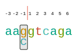
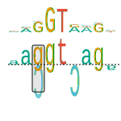
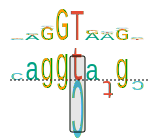
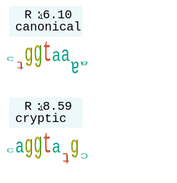
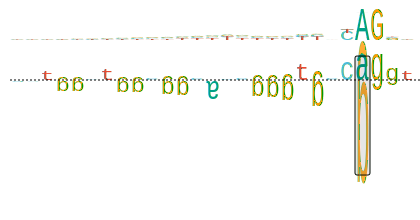
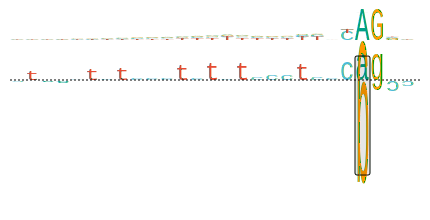
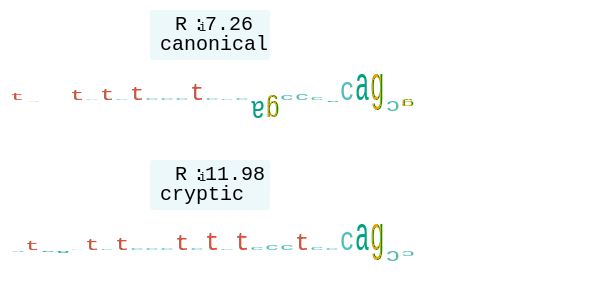

.. _rstinterpretation:

=====================
Result interpretation
=====================

Interpretability of Squirls scores is derived from the splice features that are being used to make a prediction.
From all possible features, that were ever for algorithms that evaluate variants' effect on splicing, we deliberately
chose only the informative features with a biological interpretation (see :ref:`splice-features-ref` section for more details
regarding the used features).

When reporting variants, we sort the variants by Squirls score in descending order (the most deleterious variants
on top). We put data for each individual variant into a box, and we display the following fields in the header:

* **Variant coordinates:** Summary of variant's location, e.g. ``chrX:107,849,963T>A``
* **HGVS gene symbol:** e.g. *COL4A5*
* **Squirls score:** maximum predicted splicing pathogenicity score, e.g. ``0.985``

Then, content of the box consists of three parts:

* **Variant effects on overlapping transcripts:** we use `Jannovar`_ to perform functional annotation of the variant and
  to compute variant's effect on transcript using `HGVS Sequence Variant Nomenclature`_, and we list variant effects on
  all overlapping transcripts. We also report Squirls score calculated wrt. given transcript.
* **Splicing features:** we show raw values of the splicing features in a table, see :ref:`splice-features-ref` section
  for more details regarding the features.
* **Figures:** graphics that show the most important predicted effects (see below).

Variant categories
^^^^^^^^^^^^^^^^^^

Squirls makes a decision about which figures to make for a given variant. Based on the most likely splice
altering-pathomechanism, the variant is assigned into one of four categories that dictate which figures will be
generated:

Canonical donor
###############

For a variant that is likely to disrupt a canonical donor site, we create :ref:`sequence-ruler-ref`,
:ref:`sequence-trekker-ref`, and we plot the position of :math:`\Delta R_i` canonical donor in the distribution of random
changes to sequences of the same length (see :ref:`delta-ri-ref`).

*Sequence trekker* summarizes the sequence context and the impact of the variant on the binding site. Let's consider
a ``G>C`` variant located at -1 position wrt. exon/intron border. The *ref* allele represented by normal ``c`` character
is substituted by ``g`` (*alt*). The unfavourable contact between spliceosome and the *alt* allele is represented by
drawing ``g`` upside down (see :ref:`sequence-logo-ref`):

The *distribution of random changes* shows position of :math:`\Delta R_i` canonical donor of the particular variant
in the *distribution of random changes* to sequence of the same length.
When :math:`\Delta R_i` score is positive and close to the distribution edge, then the variant reduces
the sequence information and the resulting allele is less likely to be recognized as a donor site.

.. figure:: _static/donorDelta.svg
  :alt: R_i position in distribution of random changes to sequence of the same length
  :align: center
  :width: 400
  :height: 400

Cryptic donor
#############

For a variant predicted to create a cryptic donor site, we generate :ref:`sequence-logo-ref`,
a single :ref:`sequence-walker-ref` for both *ref* and *alt* alleles, and two sequence walkers that compare the *alt*
allele with the closest canonical donor site.

Let's consider the case of a missense variant ``chr2:47,702,319C>T`` (*NM_000251.2: c.1915C>T*) reported by
`Liu et al., 1994`_ (Table 2, Kindred JV). The variant is located 91 bases upstream of the canonical donor site and
introduces a cryptic donor site into gene *MSH2*.

The site consists of these alleles:

* ``CAGGCATGC`` (*ref*)
* ``CAGGTATGC`` (*alt*)

where the ``C>T`` change located at position 5 of the *alt* allele increases the information of the allele to
:math:`R_i = 8.59`. The increase is shown on *sequence walker*, where the upside-down ``c`` from *ref* allele (an unfavorable
contact), is plotted together with the tall and normally oriented ``t`` from the *alt* allele (a favourable interaction).
The changed position is emphasized by a black box.

Two sequence walkers are drawn to compare *alt* allele with the closest donor site:

The walkers indicate that information of *alt* allele was increased to :math:`R_i=8.59`, while the information of the
downstream donor site is :math:`R_i=6.10`.

Canonical acceptor
##################

For a variant that is likely to disrupt a canonical acceptor site, we create :ref:`sequence-ruler-ref`,
:ref:`sequence-trekker-ref`, and we plot position of :math:`\Delta R_i` canonical acceptor in the distribution of random
changes to sequence of the same length (see :ref:`delta-ri-ref`).

*Sequence trekker* shows relative importance of the individual positions of the acceptor site and the impact of the
variant on the site.

.. figure:: _static/acceptorRuler.svg
  :alt: canonical acceptor ruler
  :align: center
  :width: 500
  :height: 100

We also show position of :math:`\Delta R_i` canonical acceptor in the *distribution of random changes to sequence of
the same length*. Here, the :math:`\Delta R_i` score will be positive if the variant reduces
the sequence information and if the variant is likely to reduce recognition of the acceptor site.

.. figure:: _static/acceptorDelta.svg
  :alt: R_i position in distribution of random changes to sequence of the same length
  :align: center
  :width: 400
  :height: 400

Additionally, variants that introduce ``(Y)AG`` sequence into the *AG-exclusion zone* might lead to exon skipping
or to cryptic splicing (see `Wimmer et al., 2020`_). The info regarding violation of *AG-exclusion zone* is located in
the splice features table.

Cryptic acceptor
################

For a variant that leads to creation of a cryptic acceptor site, we generate the same graphics as for the cryptic donor
site above - :ref:`sequence-logo-ref`, a :ref:`sequence-walker-ref` for both *ref* and *alt* alleles, and Sequence
walkers to compare the *alt* allele with the closest canonical acceptor site.

Let's consider the case of a variant ``chr1:16,451,824C>T`` (*NM_004431.3: c.2826-9G>A*) located 9 bases upstream of
the canonical acceptor site. The variant was first reported by `Zhang et al., 2009`_ and it introduces a cryptic
acceptor site into the *EPHA2* gene.

The site consists of these alleles:

* ``ctaactctccctctctccctcccggCC`` (*ref*)
* ``ctaactctccctctctccctcccagCC`` (*alt*)

where the ``G>A`` change is located at position 24 of the *ref* allele. The change increases the information of the allele to
:math:`R_i = 11.98`. The increase is displayed on *sequence walker*, where the upside-down ``g`` from *ref* allele
(an unfavorable contact), is plotted together with the tall and normally oriented ``a`` from the *alt* allele
(a favourable interaction). Again, the changed position is emphasized by a black box.

The sequence walkers compare the *alt* allele (:math:`R_i=11.98`) and the *alt* allele of the acceptor located 9bp
downstream (:math:`R_i=7.26`). Note that *both* walkers use the *alt* allele to display canonical site and cryptic site,
as we are interested in comparing the sites and not the alleles.

Figure types
^^^^^^^^^^^^

This section describes individual figures that we consider to be the most helpful for clinical interpretation of the
splice variants and which we generate for the variants:

.. _sequence-ruler-ref:

Sequence ruler
##############

.. figure:: _static/acceptorRuler.svg
   :width: 800
   :height: 250

Sequence rulers are SVG graphics that show the sequence of the donor or acceptor site, mark the intron-exon boundary,
and show the position of any alternate bases that diverge from the reference sequence.

.. _sequence-logo-ref:

Sequence logo
#############

.. figure:: _static/acceptorLogo.svg
   :width: 800
   :height: 400

In 1990, Tom Schneider introduced Sequence logos as a way of graphically displaying consensus sequences.
The characters representing the sequence are stacked on top of each other for each position in the aligned sequences.
The height of each letter is made proportional to its frequency, and the letters are sorted so the most common one
is on top. The height of the entire stack is then adjusted to signify the information content of the sequences at
that position. From these *sequence logos*, one can determine not only the consensus sequence but also the relative
frequency of bases and the information content (measured in bits) at every position in a site or sequence. The logo
displays both significant residues and subtle sequence patterns (`Nucleic Acids Res 1990;18:6097-100`_).

.. _sequence-walker-ref:

Sequence walker
###############

.. figure:: _static/acceptorWalker.svg
   :width: 800
   :height: 400

Tom Schneider introduced Sequence Walkers in 1995 as a way of graphically displaying how binding proteins and other
macromolecules interact with individual bases of nucleotide sequences. Characters representing the sequence are
either oriented normally and placed above a line indicating favorable contact, or upside-down and placed below the
line indicating unfavorable contact. The positive or negative height of each letter shows the contribution of that
base to the average sequence conservation of the binding site, as represented by a sequence logo
(`Nucleic Acids Res 1997;25:4408-15`_).

In 1998, Peter Rogan introduced the application of individual information content and Sequence Walkers to splicing
variants (`Hum Mutat 1998;12:153-71`_).

Our version of the sequence walker combines the reference and the alternate sequence. The positions in which the
alternate differs from the reference are indicated by a grey box and both nucleotides are shown. In many
disease-associated variants, the reference base will be position upright and the alternate base will be positioned
beneath the line.

.. _sequence-trekker-ref:

Sequence trekker
################

We combine the sequence logo (see Sequence Logos) and walker (see Sequence walkers) in a new figure that we call
*sequence trekker* (because a trek goes further than a walk).

.. _delta-ri-ref:

:math:`\Delta R_i` score distribution
#####################################

.. figure:: _static/donorDelta.svg
   :width: 800
   :height: 600

The individual sequence information of a sequence :math:`R_{i\ ref}` and an alternate sequence :math:`R_{i\ alt}` are
presented using the *Sequence walker*. This graphic shows the value of the difference between the reference sequence
and an alternate sequence as well as the distribution of random changes to sequences of the same length. A variant that
reduces the sequence information is associated with a positive :math:`\Delta R_i` score (:math:`\Delta R_i = 8.96` in
this case).

.. _Nucleic Acids Res 1990;18:6097-100: https://pubmed.ncbi.nlm.nih.gov/2172928
.. _Nucleic Acids Res 1997;25:4408-15: https://pubmed.ncbi.nlm.nih.gov/9336476
.. _Hum Mutat 1998;12:153-71: https://pubmed.ncbi.nlm.nih.gov/9711873
.. _Jannovar: https://pubmed.ncbi.nlm.nih.gov/24677618
.. _HGVS Sequence Variant Nomenclature: https://varnomen.hgvs.org
.. _Wimmer et al., 2020: https://pubmed.ncbi.nlm.nih.gov/32126153
.. _Liu et al., 1994: https://pubmed.ncbi.nlm.nih.gov/8062247
.. _Zhang et al., 2009: https://pubmed.ncbi.nlm.nih.gov/19306328
