.. _rstinterpretation:

=====================
Result interpretation
=====================

When designing Squirls, our motivation was to create an *interpretable* algorithm for identification of splice
deleterious variants.
We addressed this goal by limiting ourselves to use a small set of biologically interpretable attributes for learning
how to separate splice deleterious variants from neutral polymorphisms.

To help with interpretation of a variants that has been marked as splicing deleterious, we developed HTML result format
that presents all available information in a visually attractive way. When reporting variants, we sort the variants
by Squirls score in descending order - the most deleterious variants are placed on the top of the list.

The following picture shows an example output for variant *NM_000251.2:c.1915C>T* (*chr2:47702319C>T*), predicted to
create a novel cryptic donor site (click for a full size image):

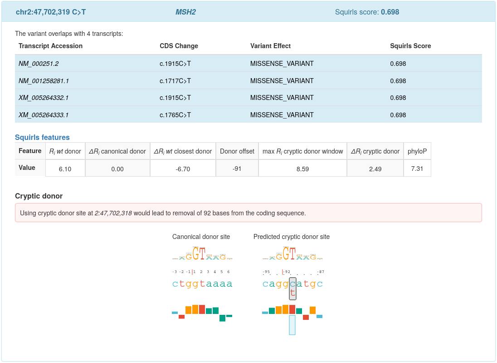

Squirls summarizes the information available for the variant in a box. The header of the box contains three fields:

* **Variant coordinates:** Summary of variant's location on used genomic assembly, e.g. *chr2:47,702,319 C>T*
* **HGVS gene symbol:** e.g. *MSH2*
* **Squirls score:** maximum predicted splicing pathogenicity score, e.g. *0.698*

The box content consists of three sections:

- **Variant effects on overlapping transcripts:** Squirls uses Jannovar to predict effect of the variant on the transcript,
  and represents the effect using `HGVS Sequence Variant Nomenclature`_. Then, the effects and Squirls scores calculated
  for the overlapping transcripts are listed in a table.
  The transcript accessions corresponding to the maximum Squirls score are emphasized by blue color
  (all 4 rows in the above example).
- **Splicing features:** Squirls shows splicing feature values in a table, see :ref:`splice-features-ref` section
  for explanations.
- **Figures:** Squirls presents SVG graphics that show the most important predicted effects.

Variant categories
^^^^^^^^^^^^^^^^^^

When generating the HTML report, Squirls makes a decision about which set of figures to make for a given variant.
Based on the most likely splice altering-pathomechanism, the variant is assigned into one of four categories that
dictate which figures will be generated:

Canonical donor
###############

Squirls creates a :ref:`sequence-trekker-ref` for variants that are likely to disrupt a canonical donor site and
to lead to either exon skipping or to utilization of a weaker cryptic site located nearby. In addition, Squirls plots
the position of :math:`\Delta R_i` canonical donor in the distribution of random changes to sequences of the same length
(see :ref:`delta-ri-ref`).

:ref:`sequence-trekker-ref` summarizes the sequence context and the impact of the variant on the binding site. Let's consider
a ``A>T`` variant located at position 4 with respect to exon/intron border. The *ref* allele represented by normal ``a`` character
is substituted by ``t``. The change location is highlighted by a black box. The unfavourable contact between
spliceosome and the *alt* allele is represented by drawing the red bar corresponding to ``t`` upside down, and by
drawing box for the ``a`` of the ref allele upwards:

.. generate the figure by running
   VmvtGenerator generator = new VmvtGenerator(true);
   String ref = "AATgtaagt", alt = "AATgtatgt";
   String svg = generator.getDonorSequenceLogoRulerAndBarChart(ref, alt);
   System.err.println(svg);

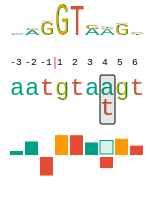

The *distribution of random changes* shows position of :math:`\Delta R_i` canonical donor of the particular variant
in the *distribution of random changes* to sequence of the same length.
When :math:`\Delta R_i` score is positive and close to the distribution edge, then the variant reduces
the sequence information and the resulting allele is less likely to be recognized as a donor site.

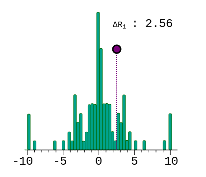

Cryptic donor
#############

For a variant predicted to create a cryptic donor site, we generate :ref:`sequence-trekker-ref`\s to compare
the candidate site to the closest canonical donor site.

Let's consider the case of a missense variant ``chr2:47,702,319C>T`` (*NM_000251.2: c.1915C>T*) reported by
`Liu et al., 1994`_ (Table 2, Kindred JV). The variant is located 91 bases upstream of the canonical donor site and
introduces a cryptic donor site into coding sequence of the *MSH2* gene.

Squirls generates a Sequence trekker for the *Canonical donor site*, the site features :math:`R_i=6.10` bits:

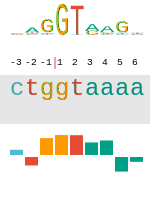

The candidate cryptic donor site consists of the following alleles, where (again) the change ``C>T`` is located
91 bases upstream of the canonical donor site:

* ``CAGG``\ **C**\ ``ATGC`` (*ref*)
* ``CAGG``\ **T**\ ``ATGC`` (*alt*)

Squirls represents alleles of the *Predicted cryptic donor site* by the following sequence trekker:

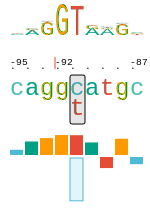

The ``T`` base introduced by the variant increases :math:`R_i` of the site by ``2.49`` bits to :math:`R_{i\ alt}=8.59`
bits.
The increase is graphically represented by drawing an upside-down blue box for ``c`` (an unfavorable contact),
and upwards pointing box for ``t`` to represent a favourable interaction between the *alt* allele and
the spliceosome.

Canonical acceptor
##################

For a variant that is likely to disrupt a canonical acceptor site, we create :ref:`sequence-trekker-ref`,
and we plot position of :math:`\Delta R_i` canonical acceptor in the distribution of random
changes to sequence of the same length (see :ref:`delta-ri-ref`).

*Sequence trekker* shows relative importance of the individual positions of the acceptor site and the impact of the
variant on the site.

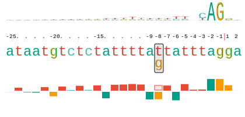

We also show position of :math:`\Delta R_i` canonical acceptor in the *distribution of random changes to sequence of
the same length*. Here, the :math:`\Delta R_i` score will be positive if the variant reduces
the sequence information and if the variant is likely to reduce recognition of the acceptor site.

.. figure:: _static/acceptorDelta.svg
  :alt: R_i position in distribution of random changes to sequence of the same length
  :align: center
  :width: 400
  :height: 400

Additionally, the variants that introduce ``(Y)AG`` sequence into the *AG-exclusion zone* might lead to exon skipping
or to cryptic splicing (see `Wimmer et al., 2020`_). The info regarding violation of the *AG-exclusion zone* is located
in the splice features table.

Cryptic acceptor
################

For the variant that leads to creation of a cryptic acceptor site, Squirls generates the same graphics as for
the cryptic donor sites - two :ref:`sequence-trekker-ref`\s to compare the candidate cryptic acceptor site to the closest
canonical acceptor site.

Let's consider the case of the variant ``chr1:16,451,824C>T`` (*NM_004431.3: c.2826-9G>A*) located 9 bases upstream of
the canonical acceptor site that introduces a cryptic acceptor site into the *EPHA2* gene (`Zhang et al., 2009`_).

The first sequence walker represents the *Canonical acceptor site*, located 9 bp downstream of the variant site:

.. Generate the figure by running
   String ref = "tccctctctccctcccggcccacagCG", alt = "tccctctctccctcccagcccacagCG";
   VmvtGenerator generator = new VmvtGenerator();
   String svg = generator.getAcceptorSequenceLogoRulerAndBarChart(ref,alt);

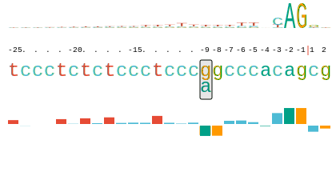

The *alt* allele of the canonical site has :math:`R_i=7.26` bits.

Then, the *Predicted cryptic acceptor site* consists of these alleles:

* ``ctaactctccctctctccctccc``\ **g**\ ``gCC`` (*ref*)
* ``ctaactctccctctctccctccc``\ **a**\ ``gCC`` (*alt*)

The corresponding sequence trekker is:

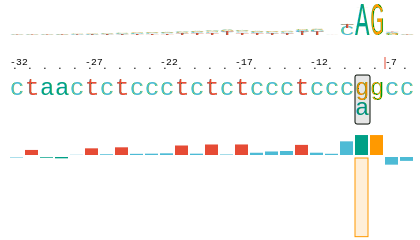

The cryptic acceptor site features :math:`R_i = 11.98` bits. Sequence trekker depicts the change by drawing the
orange box for ``g`` upside down (an unfavorable contact), and by drawing the green box for ``a`` upwards
(a favourable interaction). The changed position is emphasized by a black box on the sequence ruler.

.. note::
  Please note that Squirls uses the *alt* allele to generate sequences necessary to draw sequence trekkers for
  *both* canonical site and cryptic site. This is because we are interested in comparing the sites and not the
  individual alleles.

Figure types
^^^^^^^^^^^^

This section provides detailed explanations of the figures we generate for the variants, as described in the previous
section. We consider these figures to be the most helpful for clinical interpretation of the splice variants.

.. _sequence-ruler-ref:

Sequence ruler
##############

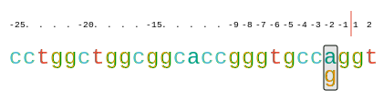

Sequence rulers are SVG graphics that show the sequence of the donor or acceptor site, mark the intron-exon boundary
(red vertical bar), and show the position of any alternate bases that diverge from the reference sequence
(black rectangle).

.. note::
  We intentionally omit the position *zero* in sequence rulers, to make the result interpretation easier for biologists,
  who are more comfortable with numbering of intronic/exonic bases that starts at *one*.

  However, please note that the correct numbering scheme starts at *zero*.
  Please visit website of professor Tom Schneider, where among `Pitfalls in Information Theory`_ he also explains
  the correct numbering scheme for sequences.

.. _sequence-logo-ref:

Sequence logo
#############

In 1990, Tom Schneider introduced Sequence logos as a way of graphically displaying consensus sequences.
The characters representing the sequence are stacked on top of each other for each position in the aligned sequences.
The height of each letter is made proportional to its frequency, and the letters are sorted so the most common one
is on top. The height of the entire stack is then adjusted to signify the information content of the sequences at
that position. From these *sequence logos*, one can determine not only the consensus sequence but also the relative
frequency of bases and the information content (measured in bits) at every position in a site or sequence. The logo
displays both significant residues and subtle sequence patterns (`Nucleic Acids Res 1990;18:6097-100`_).

.. _sequence-walker-ref:

Sequence walker
###############

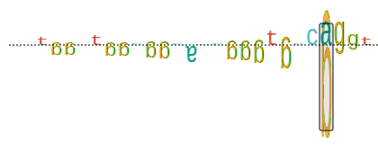

Tom Schneider introduced *Sequence walkers* in 1995 as a way of graphically displaying how binding proteins and other
macromolecules interact with individual bases of nucleotide sequences. Characters representing the sequence are
either oriented normally and placed above a line indicating favorable contact, or upside-down and placed below the
line indicating unfavorable contact. The positive or negative height of each letter shows the contribution of that
base to the average sequence conservation of the binding site, as represented by a sequence logo
(`Nucleic Acids Res 1997;25:4408-15`_).

In 1998, Peter Rogan introduced the application of individual information content and *Sequence walkers* to splicing
variants (`Hum Mutat 1998;12:153-71`_).

.. note::
  Squirls does *not* generate *Sequence walker* graphics for sequences. Instead, Squirls uses *Sequence trekker*,
  a graphics based on *Sequence walker* that is explained in the next section.

.. _sequence-trekker-ref:

Sequence trekker
################

.. Generate the figure by running
   String ref = "cctggctggcggcaccgggtgccagGT", alt = "cctggctggcggcaccgggtgccggGT";
   VmvtGenerator generator = new VmvtGenerator();
   String svg = generator.getAcceptorSequenceLogoRulerAndBarChart(ref,alt);

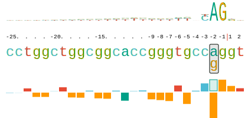

Squirls combines the sequence ruler, sequence logo, and sequence walker into a new figure that we call
*Sequence trekker* (because a trek goes further than a walk).

On top of that, sequence trekker integrates the information regarding the reference and the alternate alleles into
a single graphics.

Sequence trekker replaces the letters used in Sequence walker by bars. The bars are colored using the standard
*"Sanger"* color conventions. Similarly to Sequence walker, the bar orientation indicates favorable (up) or unfavorable
(down) contacts. The bar height shows the contribution of that base to the average sequence contribution of the binding
site. To present data for reference and alternate alleles in the same time, the bar corresponding to
the reference allele at the variant position is drawn with a semi-transparent fill.

In many disease-associated variants, the bar corresponding to the reference base will be positioned upright and
the alternate base will be facing down.

.. _delta-ri-ref:

:math:`\Delta R_i` score distribution
#####################################

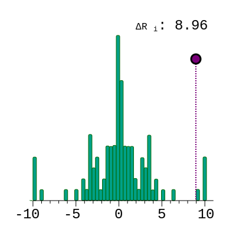

The individual sequence information of a sequence :math:`R_{i\ ref}` and an alternate sequence :math:`R_{i\ alt}` are
presented using the *Sequence trekker*. This graphic shows the value of the difference between the reference sequence
and an alternate sequence as well as the distribution of random changes to sequences of the same length. A variant that
reduces the sequence information is associated with a positive :math:`\Delta R_i` score (:math:`\Delta R_i = 8.96` bits in
this case).

.. _Nucleic Acids Res 1990;18:6097-100: https://pubmed.ncbi.nlm.nih.gov/2172928
.. _Nucleic Acids Res 1997;25:4408-15: https://pubmed.ncbi.nlm.nih.gov/9336476
.. _Hum Mutat 1998;12:153-71: https://pubmed.ncbi.nlm.nih.gov/9711873
.. _Jannovar: https://pubmed.ncbi.nlm.nih.gov/24677618
.. _HGVS Sequence Variant Nomenclature: https://varnomen.hgvs.org
.. _Wimmer et al., 2020: https://pubmed.ncbi.nlm.nih.gov/32126153
.. _Liu et al., 1994: https://pubmed.ncbi.nlm.nih.gov/8062247
.. _Zhang et al., 2009: https://pubmed.ncbi.nlm.nih.gov/19306328
.. _Pitfalls in Information Theory: http://users.fred.net/tds/lab/pitfalls.html#ignoring_zero